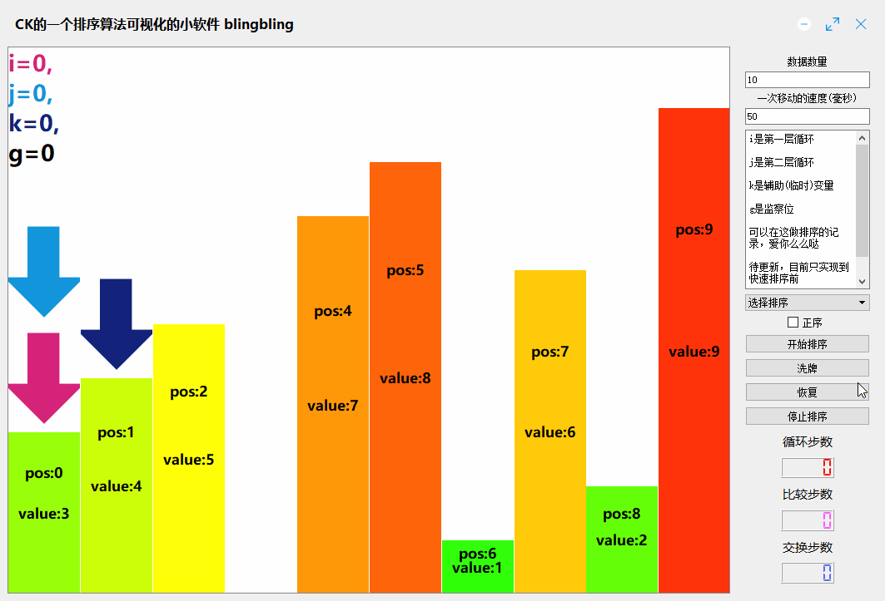
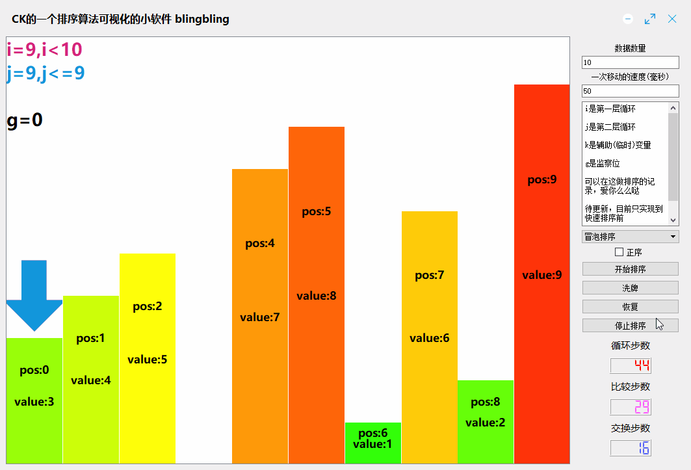
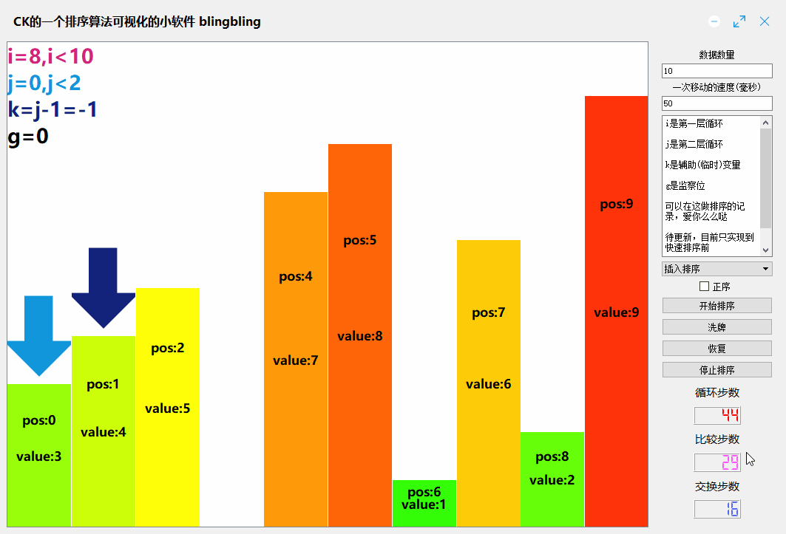
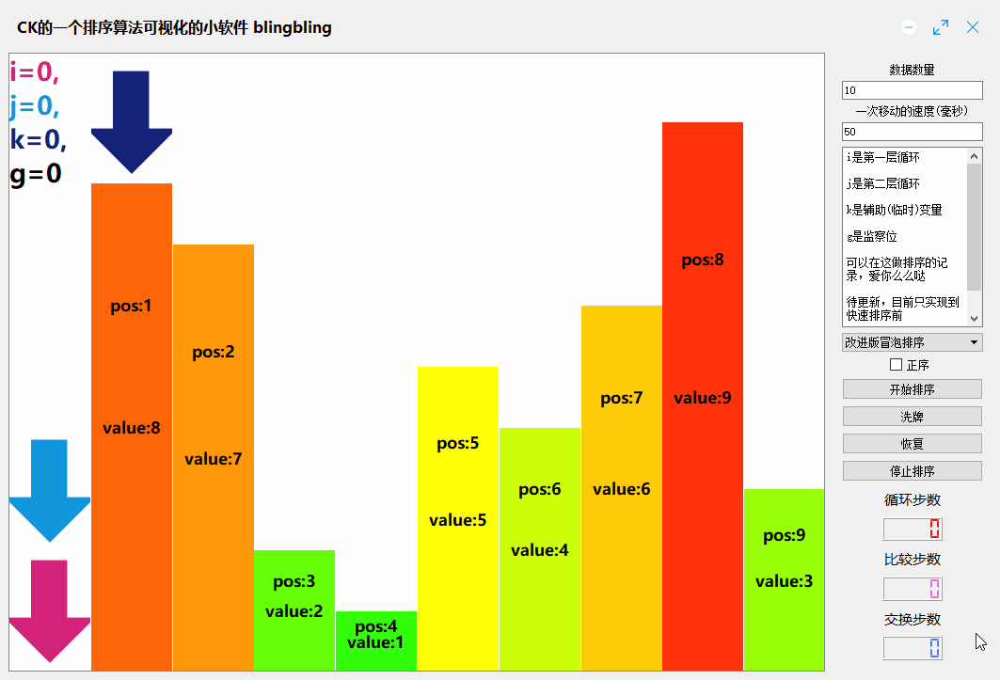
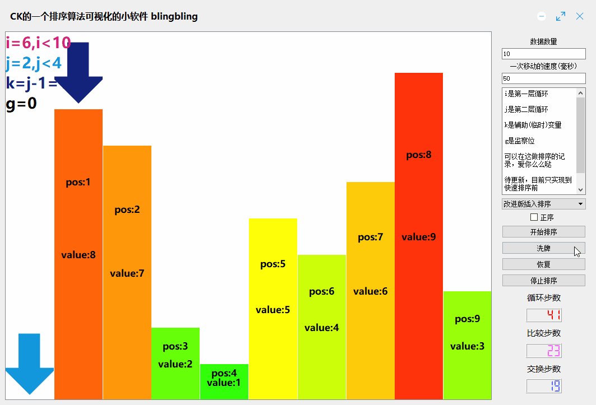
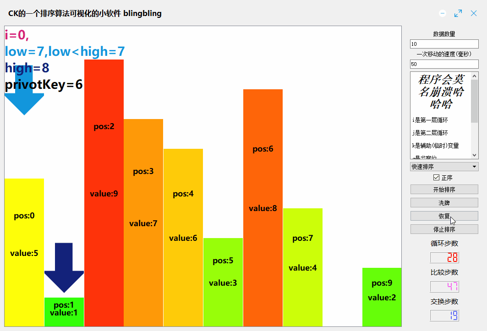

# Sorting-Visualization
qt 做的一个 排序可视化 小程序

[TOC]

***

本仓库包含以下内容：

1. qt 学习
2. 排序学习

## 内容列表

- [更新](#更新)
- [目录](#目录)
- [背景](#背景)
- [安装](#安装)
- [示例](#示例)
- [相关仓库](#相关仓库)
- [维护者](#维护者)
- [如何贡献](#如何贡献)
- [使用许可](#使用许可)

## 更新
- 2021年1月26日15:43:06 更新快排，修复一些可能崩溃的原因
- 相关介绍会放到公众号上
- 2021年1月26日00:26:03 第一版demo 已上线  在这里下载后可以直接游玩 [release](build-Sorting_Visualization-Desktop_Qt_5_9_6_MinGW_32bit-Release/release) 
- 2021年1月26日00:25:14 update readme.md

## 背景

蓝桥杯的一些排序训练 以及 未来qt的路

## 示例

|    选择排序    |                |
| :------------: | ------------------------------- |
|    冒泡排序    |  |
|    插入排序    |  |
| 改进版冒泡排序 |  |
| 改进版插入排序 |  |
|    快速排序    |  |
|                |                                 |
|                |                                 |
|                |                                 |
|                |                                 |

## 维护者

[@yujiecong](https://github.com/yujiecong)。

## 如何贡献

非常欢迎你的加入！[提一个 Issue](./issues/new) 或者提交一个 Pull Request。

本 Readme 遵循 [Contributor Covenant](http://contributor-covenant.org/version/1/3/0/) 行为规范。

### 贡献者

感谢以下参与项目的人：  

## 使用许可

[MIT License](./blob/master/LICENSE)